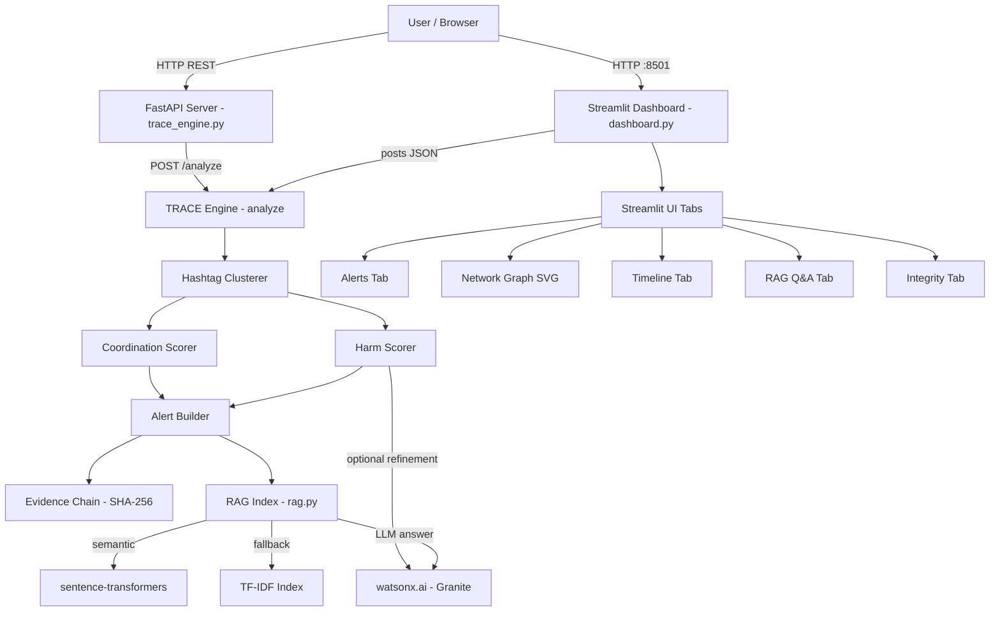

Here is the architecture document for your project:

---

# Architecture

## System Architecture

---

## Components

| Component | Technology | Responsibility |
|---|---|---|
| **Dashboard UI** | Streamlit | Interactive alert display, network graph, timeline, RAG Q&A, evidence integrity |
| **API Server** | FastAPI + Uvicorn | REST endpoints `/health`, `/analyze`, `/demo` for programmatic access |
| **TRACE Engine** | Python (pure) | Hashtag clustering, harm scoring, coordination scoring, alert classification |
| **Harm Scorer** | Lexicon + regex (Hinglish + English) | Phrase-based harm scoring with per-phrase weights |
| **Coordination Scorer** | Jaccard / k-shingle, burst detection | Near-duplicate ratio, burst timing, new account ratio |
| **Evidence Chain** | SHA-256 (linked hashing) | Tamper-evident chain of post evidence |
| **RAG Module** | TF-IDF + sentence-transformers | Retrieval-Augmented Q&A over threat briefs |
| **LLM / AI** | IBM watsonx.ai (`granite-13b-instruct-v2`) | Optional harm score refinement + RAG answer generation |
| **Embeddings** | IBM watsonx (`slate-125m-english-rtrvr`) or `all-MiniLM-L6-v2` | Semantic retrieval over alert briefs |
| **Dataset** | `make_dataset.py` (synthetic JSON) | Reproducible labelled posts across 7 threat scenarios |
| **Evaluation** | `evaluate.py` + pytest | Precision, recall, false alarm rate across 5 random seeds |

---

## Data Flow

1. **Input** — Posts arrive as a JSON array via dashboard upload, paste, or `POST /analyze` API call.
2. **Flatten** — [`flatten_posts()`](trace_engine.py:468) extracts top-level posts and nested comments into a flat list.
3. **Cluster** — [`cluster_by_hashtags()`](trace_engine.py:483) groups posts by shared hashtags; untagged posts form a `no_hashtag` cluster.
4. **Harm Score** — [`score_harm()`](trace_engine.py:304) scans each post against a weighted Hinglish + English lexicon; IBM watsonx optionally refines the score.
5. **Coordination Score** — [`score_coordination()`](trace_engine.py:366) computes near-duplicate ratio (Jaccard/k-shingle), burst timing (posts within 10 min), and new account ratio.
6. **Alert Level** — [`level_for(harm, coord)`](trace_engine.py:397) maps the two scores to `HIGH - ACT NOW`, `MEDIUM - NEEDS REVIEW`, or `LOW - MONITOR`.
7. **Evidence Chain** — [`build_evidence_chain()`](trace_engine.py:237) SHA-256 hashes each post and links them into a tamper-evident chain.
8. **RAG Index** — Alert briefs are indexed via [`RAGIndex`](rag.py:233) (TF-IDF + optional semantic embeddings) for Q&A queries.
9. **Output** — Alerts are sorted by severity and returned to the dashboard or API caller.

---

## Security Considerations

- All IBM watsonx credentials (`WATSONX_API_KEY`, `WATSONX_PROJECT_ID`, `WATSONX_REGION`) are read from **environment variables** — never hardcoded.
- The **SHA-256 evidence chain** in [`build_evidence_chain()`](trace_engine.py:237) ensures post content integrity — any tampering breaks the chain, detectable via [`verify_chain()`](trace_engine.py:255).
- The system processes **synthetic data only** — no real user PII is collected or stored.
- FastAPI input is validated via **Pydantic models** ([`AnalyzeRequest`](trace_engine.py:660)), rejecting malformed payloads.
- No authentication layer in the prototype — API routes are open (suitable for hackathon; production would require Bearer tokens).

---

## Scalability Notes

- The **FastAPI backend is stateless** — each `/analyze` call is independent and can be horizontally scaled behind a load balancer.
- **watsonx.ai calls are the bottleneck** — harm refinement and RAG answer generation are synchronous HTTP calls; request batching or async queuing (e.g. Celery) would be needed at scale.
- The **TF-IDF RAG index is in-memory** — for large corpora it should be replaced with a vector database (e.g. Milvus, Chroma, or watsonx Discovery).
- **Hashtag clustering is O(n²)** in similarity checks — at millions of posts, approximate nearest-neighbour (LSH/MinHash) would replace Jaccard pairwise comparison.
- The **Streamlit dashboard** is single-user by default; a production deployment would use Streamlit Cloud or a containerised multi-user setup behind an auth proxy.
