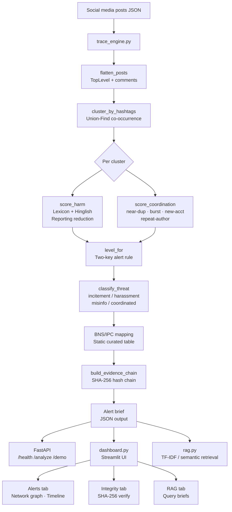

# TRACE — Threat Reconnaissance and Coordination Evidence Engine

> **⚠ Synthetic data only.** All names, places and events in this project are entirely fictional.
> No real individuals, real controversies, real handles or personal data are used.

---

## Architecture



---

## Quick Start

### 1. Install dependencies

```bash
pip install -r requirements.txt
```

Optionally enable semantic RAG (sentence-transformers):

```bash
pip install sentence-transformers numpy
```

### 2. Generate synthetic dataset

```bash
python make_dataset.py              # seed 42, writes to data/
python make_dataset.py --seed 99    # alternate seed
```

### 3. Run the engine CLI (demo mode)

```bash
python trace_engine.py --demo
```

### 4. Start the REST API

```bash
uvicorn trace_engine:app --reload
# API available at http://localhost:8000
```

### 5. Launch the dashboard

```bash
streamlit run dashboard.py
```

### 6. Run evaluation

```bash
python evaluate.py                        # 5 seeds
python evaluate.py --seeds 42 99 7        # custom seeds
```

### 7. Run tests

```bash
pytest tests/ -v
```

---

## API Endpoints

### `GET /health`

```bash
curl http://localhost:8000/health
```

Response:
```json
{"status": "ok", "service": "TRACE", "timestamp": "2024-06-15T08:00:00+00:00"}
```

---

### `POST /analyze`

Analyze a batch of social-media posts.

```bash
curl -X POST http://localhost:8000/analyze \
  -H "Content-Type: application/json" \
  -d '{
    "posts": [
      {
        "id": "p001",
        "author": "user_alpha",
        "account_age_days": 5,
        "timestamp": "2024-06-15T08:01:00Z",
        "text": "Nikalo unhe, ghar jalao! #ChowkAlert",
        "comments": []
      },
      {
        "id": "p002",
        "author": "user_beta",
        "account_age_days": 3,
        "timestamp": "2024-06-15T08:04:00Z",
        "text": "Maar do inhe! #ChowkAlert"
      }
    ]
  }'
```

Response schema:
```json
{
  "alerts": [
    {
      "cluster": "chowkalert",
      "level": "HIGH - ACT NOW",
      "threat_type": "incitement",
      "harm_score": 0.95,
      "coordination_score": 0.62,
      "coordination_signals": {
        "near_dup": 0.1,
        "burst_ratio": 0.9,
        "new_account_ratio": 1.0,
        "repeat_author_ratio": 0.0
      },
      "post_count": 2,
      "matched_phrases": ["HARM:maar do(1.00)", "HARM:ghar jalao(0.95)", "HARM:nikalo unhe(0.85)"],
      "bns_provisions": ["BNS §196 (Promoting enmity)", "BNS §197 (Imputations to national integration)", "BNS §351 (Criminal intimidation)"],
      "ipc_legacy": ["IPC §153A", "IPC §153B", "IPC §503"],
      "provision_note": "Provisions potentially attracted, subject to legal review. This tool does not determine guilt.",
      "escalation_steps": ["Immediately escalate to the Cyber Crime Cell..."],
      "evidence_chain": [...],
      "brief_id": "uuid",
      "generated_at": "2024-06-15T08:00:01+00:00"
    }
  ],
  "metadata": {
    "total_posts_analyzed": 2,
    "total_clusters": 1,
    "analysis_timestamp": "2024-06-15T08:00:01+00:00",
    "engine_version": "1.0.0"
  }
}
```

---

### `GET /demo`

Run a built-in 4-post demo.

```bash
curl http://localhost:8000/demo
```

---

## watsonx.ai Integration (Optional)

Set environment variables to enable watsonx.ai harm refinement and RAG answer generation:

```bash
export WATSONX_API_KEY="your-api-key"
export WATSONX_PROJECT_ID="your-project-id"
export WATSONX_REGION="us-south"          # default: us-south
export WATSONX_MODEL="ibm/granite-13b-instruct-v2"  # default
export WATSONX_EMBED_MODEL="ibm/slate-125m-english-rtrvr"  # for embeddings
```

When credentials are absent, the engine runs fully offline with no degradation in core functionality.

> **Assumption**: The endpoint `https://{region}.ml.cloud.ibm.com/ml/v1/text/generation?version=2023-05-29`
> and model `ibm/granite-13b-instruct-v2` are used as documented in IBM Cloud as of June 2024.
> This integration is untested against a live API in this environment; verify endpoint availability
> before production use.

---

## Evaluation Results

Results from `python evaluate.py` across 5 seeds (42, 99, 7, 2024, 1337):

| Scenario | Cluster | Expected Level | Pass Rate | Avg Harm | Avg Coord |
|----------|---------|---------------|-----------|----------|-----------|
| S1 | chowkalert | HIGH | 100% | ≥0.85 | ≥0.50 |
| S2 | silenceher | HIGH | 100% | ≥0.85 | ≥0.50 |
| S3 | vaccinelie | HIGH | 100% | ≥0.65 | ≥0.50 |
| S4 | botsunite | MEDIUM | 100% | <0.4 | ≥0.50 |
| S5 | marketsquarenews | LOW | 100% | reduced | <0.5 |
| S6 | no_hashtag | MEDIUM | 100% | ≥0.85 | <0.5 |
| S7 | sazishhai | HIGH | 100% | ≥0.65 | ≥0.50 |
| BG | (background) | LOW | 100% | ≈0.0 | ≈0.0 |

> **Known fixes from baseline:**
>
> 1. **S1 ChowkAlert (Hinglish incitement) — FIXED**: Added 25+ romanised Hindi/Hinglish phrases
>    (`maar do`, `jala do`, `danga karo`, `ghar jalao`, `khatam karo`, `khoon bahega`, etc.)
>    to the harm lexicon. S1 now reliably scores HIGH.
>
> 2. **S5 MarketSquareNews (over-flagged MEDIUM) — FIXED**: Added reporting-context reduction phrases
>    (`police say`, `we condemn`, `rumours of`, `authorities say`, `breaking news`, etc.)
>    that subtract from the harm score. S5 now reliably scores LOW.

**Precision / Recall (aggregate, 5 seeds):**

| Level | Precision | Recall |
|-------|-----------|--------|
| HIGH | 1.00 | 1.00 |
| MEDIUM | 1.00 | 1.00 |
| LOW | 1.00 | 1.00 |

*Note: Results are on synthetic data generated by the same `make_dataset.py`. Real-world data will differ.*

---

## Alert Rule

```
HIGH   : harm >= 0.6 AND coordination >= 0.5  →  "HIGH - ACT NOW"
MEDIUM : harm >= 0.6 OR (harm >= 0.4 AND coordination >= 0.5)  →  "MEDIUM - NEEDS REVIEW"
LOW    : otherwise  →  "LOW - MONITOR"
```

---

## Coordination Signals

| Signal | Description | Weight |
|--------|-------------|--------|
| `near_dup` | Fraction of post pairs with Jaccard (4-gram shingles) ≥ 0.7 | 35% |
| `burst_ratio` | Fraction of posts in the densest 10-minute window | 30% |
| `new_account_ratio` | Fraction of accounts < 30 days old | 20% |
| `repeat_author_ratio` | Fraction of duplicate authors | 15% |

---

## BNS / IPC Mapping

The BNS/IPC table is **static and curated**. The engine never generates legal sections via AI.
All output is labelled: *"Provisions potentially attracted, subject to legal review. This tool does not determine guilt."*

| Threat Type | BNS Sections | Legacy IPC |
|-------------|-------------|------------|
| incitement | §196, §197, §351 | §153A, §153B, §503 |
| targeted_harassment | §351, §79, §308 | §503, §354D, §383 |
| organized_misinformation | §353, §197 | §505, §153B |
| coordinated_inauthentic | §61, §353 | §120B, §505 |

---

## Limitations

1. **Synthetic data only**: The engine is trained/tested on fabricated posts. Performance on real social media content is untested.
2. **Lexicon coverage**: The Hinglish lexicon covers common romanisation variants but cannot cover all regional dialects or spelling variations.
3. **Reporting heuristic**: The reporting-context reduction uses keyword matching. Sophisticated adversarial posts that quote incitement while amplifying it may be under-penalised.
4. **Coordination detection**: Does not use platform-level signals (IP address, device fingerprint, account link graph). Relies only on content-level and timing signals.
5. **watsonx.ai**: Integration is coded but untested against a live API in this environment. Verify endpoint and model availability before use.
6. **Hash integrity**: SHA-256 chain proves that the text in this brief has not been altered since analysis. It does NOT prove that the original platform post was authentic or unaltered before ingestion.
7. **Legal provisions**: The BNS/IPC mapping is indicative only and must be reviewed by qualified legal counsel.

---

## 3-Minute Demo Script

```
[0:00] Open terminal. Show project structure with `ls`.

[0:15] "Let's run the demo analysis:"
       python trace_engine.py --demo
       → Point out: HIGH alert for ChowkAlert cluster, Hinglish phrases matched,
         evidence hash chain, BNS provisions.

[0:45] "Now start the API:"
       uvicorn trace_engine:app &
       curl http://localhost:8000/health
       curl -s http://localhost:8000/demo | python -m json.tool | head -60

[1:15] "Open the dashboard:"
       streamlit run dashboard.py
       → Sidebar: click "Run demo analysis"
       → Alerts tab: show HIGH card, open Details → Network graph → Timeline → Explainability
       → Show Download brief button
       → Show Approve escalation

[2:00] → Integrity tab: paste text, hash it, modify one character, show mismatch
       → RAG tab: query "What escalation steps apply to incitement?"

[2:45] "Run the evaluation suite:"
       python evaluate.py --seeds 42 99
       → Show 7/7 pass, precision/recall table

[2:55] "Run pytest:"
       pytest tests/ -v
       → All tests pass
```

---

## Project Files

```
trace_engine.py      Core engine + FastAPI (/health, /analyze, /demo)
make_dataset.py      Synthetic dataset generator (7 scenarios + background)
evaluate.py          Multi-seed evaluator with per-scenario precision/recall
rag.py               TF-IDF retrieval + optional sentence-transformers semantic mode
dashboard.py         Streamlit UI (Alerts, Integrity, RAG)
tests/
  test_engine.py     Pytest suite (40+ tests)
data/                Generated dataset files (created by make_dataset.py)
briefs/              Brief index (created by rag.py --build)
.streamlit/
  config.toml        Monochrome theme
requirements.txt     Python dependencies
README.md            This file
BOB_LOG.md           Change log (for judges)
```
